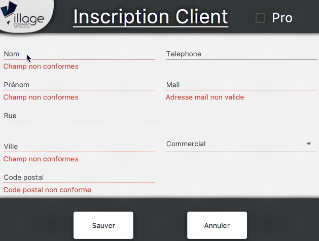
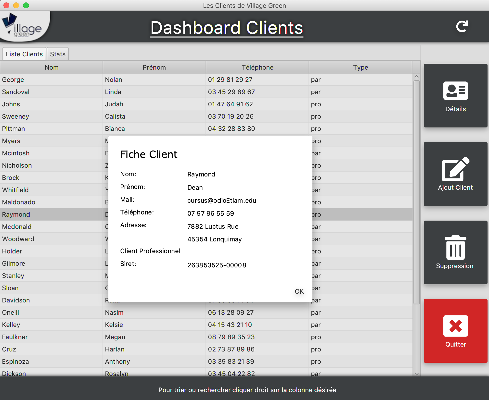
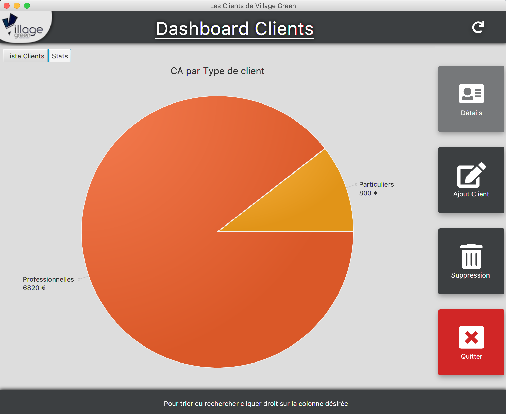

# fil-rouge
Le repo de mon projet à l'AFPA

__Objectif:__
Ce projet consiste à réaliser le CRM d'un magasin de musique nommé "Village Green".
Le tout en utilisant le __SQL__ pour la base et __Java__ pour l'application Desktop et un portail Web en __PHP__.

 

## Phase 1:
Elaboration de la base avec la méthode MCD et céation d'un base de tests.

## Phase 2:
Elaboration de l'appli desktop en suivant un modèle DAO
### WIP appli desktop en JavaFX
__Fenêtre de création de clients:__ 

Avec validation du formulaire (utilisant les validators de JFoenix) et selection de client pro. 

__Road map:__

* ~~TODO: fenetre ajout client~~ (OK)

* ~~TODO: fenetre liste client~~ (OK)
avec détail sous forme dialog et liste triable par clique droit

  

* TODO: repartition des commandes par type client (en cours)

* TODO: Javadoc (à faire)
